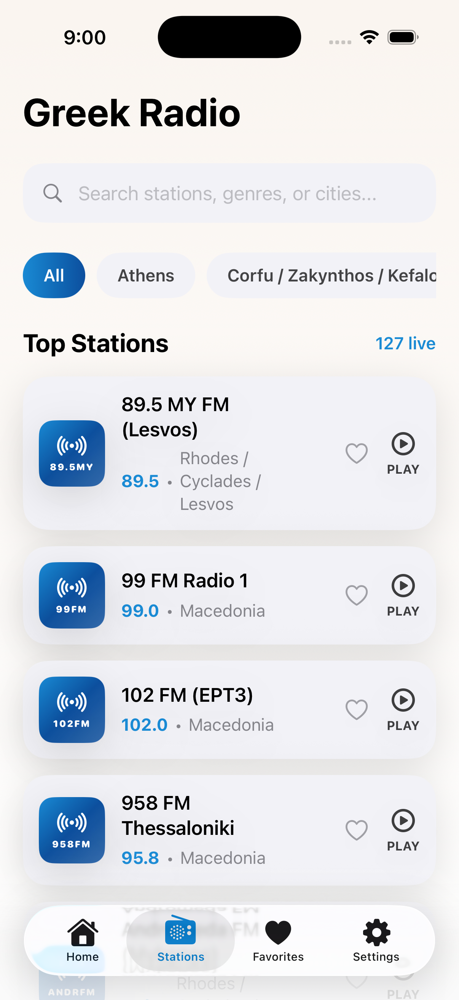

# Greek Radio

A native iOS app for streaming Greek radio stations, built with SwiftUI.



## Features

- **Browse & search** — filter stations by region or search by name, genre, or city
- **Background playback** — audio continues when the app is locked or sent to the background
- **Lock screen controls** — play, pause, skip forward/backward via the system Now Playing UI
- **Mini player** — persistent bottom bar with quick controls while browsing
- **Full player** — live throughput graph, buffering indicator, and stream details
- **Favorites** — save stations with a heart tap; persisted with SwiftData
- **Accent themes** — five color themes: Sunset, Aegean, Olive, Berry, Graphite
- **In-app language switcher** — switch between English and Greek without leaving the app
- **Pull-to-refresh** — reload station list on demand

## Tech Stack

| Layer | Technology |
|---|---|
| UI | SwiftUI |
| Persistence | SwiftData |
| Audio | AVFoundation + MediaPlayer |
| Backend | Supabase (PostgreSQL) |
| Review prompts | StoreKit |

## Requirements

- iOS 26.0+
- Xcode 26+

## Project Structure

```
Source/Greek Radio/
├── Greek Radio.xcodeproj
└── Greek Radio/
    ├── App/                  # App entry point
    ├── Features/
    │   └── Main/             # ContentView (tab bar, station list, player sheet)
    ├── Localization/         # In-app language support
    ├── Persistence/          # SwiftData models (FavoriteStation)
    ├── Playback/             # RadioPlayer, RadioStationStore, RadioStation model
    └── Resources/            # Assets, entitlements
```

## Running Locally

1. Clone the repo
2. Open `Source/Greek Radio/Greek Radio.xcodeproj` in Xcode
3. Select a simulator or device running iOS 26+
4. Build and run (`⌘R`)

Station data is fetched from a Supabase backend on first launch and cached locally. The app works offline using the cached station list.

## Author

Patrick Chamelo
